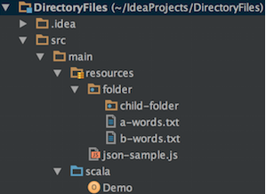

# Spark设置Hadoop配置文件
## 一般设置
- Spark程序中如果没有设置Hadoop配置文件，每次读写都要加前缀 `hdfs://host:port/path`;
- 设置Hadoop的配置之后，我们就可以直接在Spark开发的时候上写上HDFS上的文件路径即可读取相应的文件；
- 当SparkContext创建的时候，会去读取classpath下的core-default.xml和core-site.xml文件，所以我们可以将Hadoop全局配置文件core-site.xml放到项目的resources文件夹下，来让Spark读取Hadoop配置；

## 其他方式
- 也可以用代码的方式来设置我们的Hadoop配置，通过`sc.hadoopConfiguration.set(name,value)`的方式：
	- `sc.hadoopConfiguration.set("fs.defaultFS", "hdfs://localhost:port")`
- 加载特定命名的配置文件，可以使用:
	```java
	val conf = new SparkConf().setAppName("test").setMaster("local[*]")
    val spark = SparkSession.builder().config(conf).getOrCreate()
    val sc = spark.sparkContext
		sc.hadoopConfiguration.addResource("custom.xml")
	```
## 访问resource文件

	

- Let’s try to read the file from resources line by line:
```java
import scala.io.Source
object Demo {
  def main(args: Array[String]): Unit = {
    val fileStream = getClass.getResourceAsStream("/json-sample.js")
    val lines = Source.fromInputStream(fileStream).getLines
    lines.foreach(line => println(line))
  }
}
```
- List files from a directory:
```java
import java.io.File
object Demo {
  def main(args: Array[String]): Unit = {
    val path = getClass.getResource("/folder")
    val folder = new File(path.getPath)
    if (folder.exists && folder.isDirectory)
      folder.listFiles
        .toList
        .foreach(file => println(file.getName))
  }
}
```
