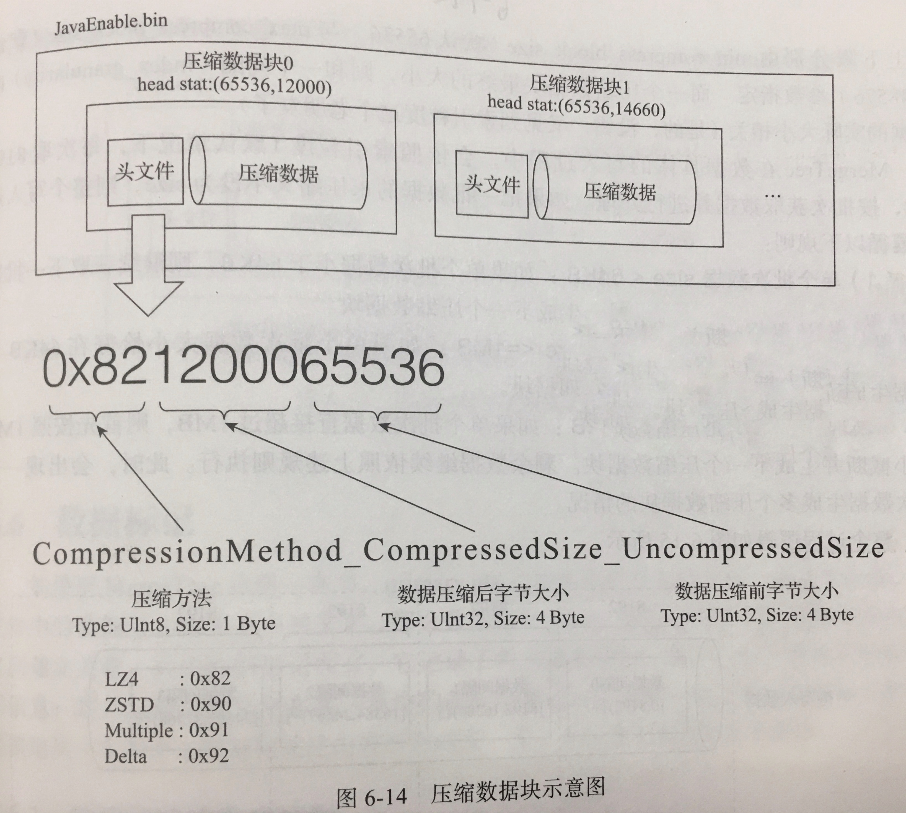

# ClickHouse

## 核心特性
### Tips
1. 在索引方面，使用了LSM树所使用到的稀疏索引；
2. 在数据文件的设计上，则沿用了LSM树中的数据段的思想，即数据段内数据有序，借助稀疏索引定位数据段；
3. 基于上述基础，OLAP Server引入列式存储，将索引文件和数据文件按照列字段的粒度进行分拆，减少数据读取的范围；

### CK不适用场景
1. 不支持事务；
2. 不擅长根据主键按行进行查询（支持），所以不应该把CK当作Key-Value数据库使用；
3. 不擅长按行删除数据（支持）。

### 完备的DBMS功能
CK拥有完备的管理功能，称得上是一个DBMS，而不仅仅是一个数据库：
1. DDL（数据定义语言）：可以动态地创建、修改或删除数据库、表和视图，无需重启服务；
2. DML（数据操作语言）：可以动态地查询、插入、修改或删除数据；
3. 权限管理：可以按照用户设置数据库或表的权限；
4. 数据备份和恢复：提供了数据备份导出与导入恢复机制，满足生产环境需求；
5. 分布式管理：提供集群模式，能够自动管理多个数据节点;
6. CK采用关系模型和SQL语言。

### 列式存储与数据压缩
1. 他俩是相伴而生的，一般来说 列式存储是数据压缩的前提；
2. 列式存储可以有效地减少查询时所扫描的数据量；
3. 属于同一字段的数据拥有相同的数据类型和实现语义，重复项的可能性更高，则可压缩率就越高，数据体量就越小，则数据在网络中传输越快，对网络带宽和磁盘IO的压力就越小；
4. CK采用列式存储，列与列之间由不同文件分别保存（主要是指MergeTree表引擎），数据默认使用[LZ4算法](./docs/olap/clickhouse/LZ4.md)压缩，列式存储除了降低IO和存储压力之外，还为向量化执行做好了铺垫； 

### 向量化执行引擎
1. 向量化执行，可以简单地看作一项消除程序中循环的优化。简单例子：非向量化执行是用1台机器循环制作n次，向量化执行是用n台机器执行1次。
2. 向量化执行需要用到CPU的SIMD指令，Single Instruction Multiple Data,即单条指令操作多条数据，它的原理是在CPU寄存器层面实现数据的并行操作。
（CK目前使用SSE4.2指令集实现向量化执行）

### 数据分片
1. CK在数据存储方面，既支持分区（纵向扩展，利用多线程），也支持分片（横向扩展，利用分布式原理）；
2. CK支持分片，而分片则依赖集群，每个分片对应一个服务节点，分片数量上限取决于节点数量（1个分片只能对应一个服务节点）；
3. CK没有高度自动化的分片功能，CK提供了本地表(Local Table)和分布式表(Distributed Table)的概念，一张本地表等同于一份数据的分片；而分布式表本身不存储数据，它是本地表的访问代理，作用类似于分库中间件；借助分布式表，能够代理访问多个数据分片，从而实现分布式查询；（业务初期数据量小可以使用单个节点的本地表，数据量增长再通过新增数据分片分流数据，并通过分布式表实现分布式查询）；
4. CK采用Multi-Master多主架构，客户端访问任何一个节点都能得到相同效果，天然规避了单点故障问题；

## 架构设计
### Column 与 Field 与 DataType
1. 内存中的一列数据由一个Column对象表示，Column对象分为接口和实现两部分；
2. 如果要操作单个具体数值(也就是单列中的一行数据)，则需要Field对象，它代表一个单值；与Column对象的泛化设计思路不同，Field对象是用了聚合的设计模式;
3. DataType负责数据的序列化与反序列化,但是它不直接负责数据的读取，而是从Column或Field对象获取。

### Block与Block流
1. Column 和 Field组成了数据的基本映射单元，但还缺少数据类型、列名等信息；Block对象可以看作是数据表的子集，本质是由 数据对象、数据类型 和列名 组成的三元组(即 Column、DataType 和 列名字符串)；
2. Column提供了数据的读取能力，DataType提供了数据正反序列化，通过Block对象就可以完成一系列的数据操作；
3. 有了Block这一层对象封装之后，Block流就水到渠成，流操作有两组顶层接口：IBlockInputStream 负责数据的读取和关系运算，IBlockOutputStream负责将数据输出的下一个环节；

### Table与Parser与Interpreter
1. 底层设计中并没有Table对象，它直接使用 IStorage接口指代数据表；在数据查询时，IStorage负责根据AST查询语句的指示要求返回指定的原始数据，后续对数据的进一步加工、计算和过滤，则会统一交给Interpreter解释器对象处理；
2. Parser分析器负责创建AST对象，而Interpreter解释器负责解释AST，并进一步创建查询的执行管道；

### Cluster与Replication
1. CK集群由分片(Shard)组成，而每个分片又通过副本(Replica)组成；
2. CK的一个节点只能拥有一个分片，也就是说要实现1个分片、1个副本，则至少需要部署2个服务节点；
3. 分片只是一个逻辑概念，其物理承载还是由副本承担的；

## CK为何快
1. CK会在内存中进行Group BY，并且使用HashTable装载数据；
2. 以字符串为例，对于常量，使用Volnitsky算法，对于非常量，使用CPU的向量化执行SIMD，暴力优化；正则匹配使用re2和hyperscan算法，性能是算法选择的首要目标；
3. 列式存储、向量化执行引擎 和 表引擎 都是它的杀手锏。

## 数据定义
### 数据库引擎

数据库目前支持5中引擎：
1. Ordinary： 默认引擎，在此数据库下可以使用任意类型的表引擎；
2. Dictionary: 字典引擎，此类数据库会自动为所有数据字典创建他们的数据表；
3. Memory：内存引擎，用于存放临时数据，此类数据库下的数据表只会停留在内存中，不会涉及任何磁盘操作，当服务重启后数据会被清除；
4. Lazy： 日志引擎，此类数据库只能使用Log系列的表引擎；
5. MySQL：此类数据库会自动拉取远端MySQL中的数据，并为它们创建MySQL表引擎的数据表。

## 数据字典

数据字典是以键值和属性映射的形式定义数据；字典中数据会主动或被动加载到内存（数据是在CK启动时加载还是在首次查询时加载 由参数设置决定），并支持动态更新；
由于字典常驻内存的特性，所以它适合保存常量或经常使用的维度数据，以避免不必要的JOIN查询。
### 内置字典

内置字典默认关闭，可以通过将config.xml文件中path_to_regions_hierarchy_file 和 path_to_regions_names_files两个配置打开来开启，这两项配置是惰性加载的，只有当字典首次被查询时才会出发加载操作。

### 外部扩展字典

1. 外部扩展字典是以插件形式注册到CK中，由用户自定义数据模式及数据来源。
2. 扩展字典由config.xml文件中的dictionaries_config配置来指定，默认情况下CK会自动识别并加载/etc/clickhouse-server目录下所有以_dictionary.xml结尾的配置文件。同时CK也能够动态感知此目录下配置文件的各种变化，并支持不停机在线更新配置文件。
3. 在单个字典配置文件内可以定义多个字典，其中每一个字典由一组dictionary元素定义，dictionary元素中包含5个子元素，均为必填。
4. 扩展字典目前不支持增量更新，但部分数据源能够依照标示判断，只有在数据源发生实质变化后才实施更新，这个判断源数据是否被修改的标识在字典内部称为previous。
（对于文件数据源，previous的值来自系统文件的修改时间；对于MySQL(InnoDB)等数据源，previous的值源于invalidate_query中定义的SQL语句。）

### 扩展字典的基本操作

1. 源数据查询：通过system.dictionaries系统表，可以查询扩展字典的元数据信息；
2. 数据查询：通过字典函数获取字典数据；
3. 字典表：字典表是使用Dictionary表引擎的数据表，通过这张表能查询到字典中的数据；
4. 使用DDL查询创建字典：19.17.4.11之后CK支持使用DDL查询创建字典。

## MergeTree原理解析

表引擎决定了一张数据表的最终“性格”，比如数据表拥有何种特性、数据以何种形式被存储以及如何被加载；
在众多表引擎中，又属合并树(MergeTree)表引擎及其家族系列(*MergeTree)最为强大，在生产环境中大部分会用此系列的表引擎；
MergeTree作为合并树家族中最基础的表引擎，提供了主键索引、数据分区、数据副本和数据采样等基本能力；
### MergeTree创建方式与存储结构
MergeTree在写入数据时，总会以数据片段写入磁盘，且数据片段不可修改，为了避免片段过多，CK后台会定期合并数据片段，属于相同分区的数据片段会被合并成一个新片段；
#### MergeTree创建方式
表的创建方式大致相同，但需要ENGINE=MergeTree(), MergeTree 引擎没有参数;  
CREATE TABLE [IF NOT EXISTS] [db.]table_name [ON CLUSTER cluster]  
(  
    &nbsp; &nbsp; &nbsp; name1 [type1] [DEFAULT|MATERIALIZED|ALIAS expr1] [TTL expr1],  
    &nbsp; &nbsp; &nbsp; &nbsp; name2 [type2] [DEFAULT|MATERIALIZED|ALIAS expr2] [TTL expr2],  
    &nbsp; &nbsp; &nbsp; &nbsp; ...  
    &nbsp; &nbsp; &nbsp; &nbsp; INDEX index_name1 expr1 TYPE type1(...) GRANULARITY value1,  
    &nbsp; &nbsp; &nbsp; &nbsp; INDEX index_name2 expr2 TYPE type2(...) GRANULARITY value2  
) ENGINE = MergeTree()  
ORDER BY expr  
[PARTITION BY expr]  
[PRIMARY KEY expr]  
[SAMPLE BY expr]  
[TTL expr [DELETE|TO DISK 'xxx'|TO VOLUME 'xxx'], ...]  
[SETTINGS name=value, ...]  
-----
1. PARTITION BY [选填]：分区键，支持单列、多个列的元组以及列表达式；如果不声明分区键，则CK会生成一个名为all的分区；合理使用数据分区，可以有效减少查询时数据文件的扫描范围；
2. ORDER BY [必填]：排序键，支持单列、多个列的元组以及列表达式；默认情况下，主键(PRIMARY KEY)与排序键相同；
3. PRIMARY KEY[选填]：主键，声明之后会依照主键字段生成一级索引，用于加速表查询；默认情况下，主键(PRIMARY KEY)与排序键相同，所以通常直接使用ORDER BY 代为指定主键，无须刻意声明；与其他数据库不同，MergeeTree主键允许存在重复数据(ReplacingMergeTree可以去重)；
4. SAMPLE BY [选填]：抽样表达式，用于声明数据以何种标准进行采样，如果用了此配置，那么在主键的配置中也需要声明同样的表达式；
5. SETTINGS — 控制 MergeTree 行为的额外参数：  
index_granularity — 索引粒度。索引中相邻的『标记』间的数据行数。默认值，8192 。参考数据存储。  
index_granularity_bytes — 索引粒度，以字节为单位，默认值: 10Mb。如果想要仅按数据行数限制索引粒度, 请设置为0(不建议)。  
enable_mixed_granularity_parts — 是否启用通过 index_granularity_bytes 控制索引粒度的大小。在19.11版本之前, 只有 index_granularity 配置能够用于限制索引粒度的大小。当从具有很大的行（几十上百兆字节）的表中查询数据时候，index_granularity_bytes 配置能够提升ClickHouse的性能。如果你的表里有很大的行，可以开启这项配置来提升SELECT 查询的性能。  
use_minimalistic_part_header_in_zookeeper — 是否在 ZooKeeper 中启用最小的数据片段头 。如果设置了 use_minimalistic_part_header_in_zookeeper=1 ，ZooKeeper 会存储更少的数据。更多信息参考『服务配置参数』这章中的 设置描述 。  
min_merge_bytes_to_use_direct_io — 使用直接 I/O 来操作磁盘的合并操作时要求的最小数据量。合并数据片段时，ClickHouse 会计算要被合并的所有数据的总存储空间。如果大小超过了 min_merge_bytes_to_use_direct_io 设置的字节数，则 ClickHouse 将使用直接 I/O 接口（O_DIRECT 选项）对磁盘读写。如果设置 min_merge_bytes_to_use_direct_io = 0 ，则会禁用直接 I/O。默认值：10 * 1024 * 1024 * 1024 字节。  
merge_with_ttl_timeout — TTL合并频率的最小间隔时间，单位：秒。默认值: 86400 (1 天)。  
write_final_mark — 是否启用在数据片段尾部写入最终索引标记。默认值: 1（不建议更改）。  
merge_max_block_size — 在块中进行合并操作时的最大行数限制。默认值：8192  
storage_policy — 存储策略。 参见 使用具有多个块的设备进行数据存储.  
min_bytes_for_wide_part,min_rows_for_wide_part 在数据片段中可以使用Wide格式进行存储的最小字节数/行数。你可以不设置、只设置一个，或全都设置。参考：数据存储  

### MergeTree的存储结构

MergeTree表引擎中的数据会按照分区目录的形式保存到磁盘，完整存储结构如下：
--------
table_name 
| 
|-partition_1 
| |-checksums.txt&nbsp; \   
| |-columns.txt&nbsp; &nbsp; &nbsp; &nbsp; |   
| |-count.txt&nbsp; &nbsp; &nbsp; &nbsp; &nbsp; &nbsp; |   
| |-primary.idx&nbsp; &nbsp; &nbsp; &nbsp; |   
| |-[Column].bin&nbsp; &nbsp; |&nbsp; 基础文件 
| |-[Column].mrk&nbsp; &nbsp; &nbsp; |   
| |-[Column].mrk2&nbsp; /   
| |   
| |-partition.dat&nbsp; &nbsp; &nbsp; &nbsp; &nbsp; &nbsp; &nbsp; &nbsp; &nbsp; \ 使用分区键时才会生成   
| |-minmax_[Column].idx&nbsp; &nbsp; /   
| |   
| |-skp_idx_[Column].idx&nbsp; &nbsp; &nbsp; \	使用二级索引时才会生成   
| |-skp_idx_[Column].mrk&nbsp; &nbsp; /   
|   
|-partition_2   
|   
|-partition_n   
--------
上图可以看出，一张表的物理结构分为3层：数据表目录、分区目录 和 分区下具体的数据文件:
1. partition：分区目；
2. checksums.txt：校验文件，二进制格式存储；它保存了 其余各类文件(primary.idx、count.txt等)的size大小以及size的哈希值，用于快速检验文件的完整性和正确性；
3. columns.txt：列信息文件，明文格式存储；保存列字段信息；
4. count.txt：计数文件，明文格式存储；记录当前分区数据的总条数；
5. primary.idx：一级索引文件，二进制格式存储；用于存放稀疏索引，一张MergeTree表只能只能声明一次一级索引(通过ORDER BY 或 PRIMARY KEY)。借助稀疏索引，在数据查询的时候能够排除主键 条件范围之外的数据文件，减少数据扫描范围，加快查询速度；
6. [Column].bin：数据文件，压缩格式存储，默认为LZ4压缩格式，用于存储某一列数据；由于MergeTree采用列式存储，所以每一列都拥有独立的.bin数据文件，并以列名命名；
7. [Column].mrk：列字段标记文件，二进制格式存储，保存了.bin文件中数据的偏移量；标记文件与稀疏索引对齐，又与.bin文件一一对应，每个字段都会拥有与其对应的.mrk标记文件，所以MergerTree通过标记文件建立了primary.idx稀疏索引与.bin熟据文件之间的映射关系；
-------
	稀疏索引(一级索引primary.idx) -> 标记文件(.mrk)[找到对应数据的偏移量] -> 数据文件(.bin)[通过偏移量读取数据]
-------
8. [Column].mrk2：如果使用了自适应大小的索引间隔，则标记文件会以.mrk2 命名，工作原理与.mrk文件相同；
9. partition.dat 与 minmax_[Column].idx：如果使用了分区键，例如PARTITION BY toYYYYMM(EventTime)，则会额外生成partition.dat和minmax索引文件，他们均是二进制格式存储；partition.dat用于保存当前分区的分区表达式最终生成的值；minmax索引文件用于标记当前分区的分区字段对应原始数据的最值；在这些分区索引的作用下，能够跳过不必要的数据分区目录，从而减少最终需要扫描的数据范围；
10. skp_idx_[Column].idx与skp_idx_[Column].mrk：如果声明了二级索引，则会生成相应的二级索引文件和标记文件，都使用二进制格式存储；二级索引在CK中又称为跳数索引，最终目标与一级索引相同，都是为了进一步减少所需扫描的数据范围，加速查询。

### 数据分区
- 在MergeTree中数据是以分区目录的形式组织的，数据分区(partition)与数据分片(shard)是不同的概念，数据分区是针对本地数据而言的，是对数据的一种纵向的切分;
- MT并不能依靠分区特性将一张表的数据分布存储到多个CK服务节点，而数据分片具有横向切分的能力；
#### 数据分区规则
| 类型     | 样例数据        | 分区表达式             | 分区ID                        |
|----------|-----------------|------------------------|-------------------------------|
| 无分区键 |                 | 无                     | all                           |
| 整型     | 18, 19, 20      | PARTITION BY Age       | 分区1:18  分区2:19   分区3:20 |
| 日期     | 2020-01-01      | PARTITION BY EventTime | 分区1: 20200101               |
| 其他     | ‘www.baidu.com’ | PARTITION BY Url       | 分区1:127129jkhas8239123n13   |
-----
> 如果分区键取值不是整型，也不是日期，例如String\Float等，则通过128位Hash算法取其Hash值作为分区ID。
> 多个ID之间是通过-连字符链接的。
-----
#### 分区目录的命名规则
PartitionID_MinBlockNum_MaxBlockNum_Level
- PartitionID：就是分区ID；
- MinBLockNum和MaxBlockNum：最小、大数据块编号；（BlockNum是一个表内自增的编号，从1开始累加）
- Level：合并层次，可以理解为某个分区被合并过的次数。
 
&nbsp; &nbsp; &nbsp; &nbsp; 20200101_1_1_0
----

#### 分区目录合并过程
- 分区目录是在数据写入过程中被创建的，伴随着新数据的写入(INSERT)，MergeTree会生成一批新的分区目录;
- 在之后的某个时刻(写入后10-15分钟，也可以手动执行optimize查询语句)，CK会通过后台任务将相同分区的多个目录合并成一个目录，目录中的索引和数据文件也会进行合并；
- 旧分区目录不会被立刻删除，而是在之后某个时刻由后台任务删除(默认8分钟)，但是旧分区目录已经不再是激活状态(active=0)，在数据查询时会自动被过滤掉。

新目录名称的合并方式遵循以下规则：
- MinBlockNum：取同一分区内所有目录中最小的MinBlockNum;
- MaxBlockNum：取同一分区内所有目录中最大的MaxBlcokNum;
- Level：取同一分区内最大Level值并加1.

### 一级索引
- MergeTree定义主键PRIMARY KEY之后，会依据index_granularity间隔(默认8192行)，为数据表生成一级索引并保存至primary.idx文件；
- 更为常见的简化形式是直接通过ORDER BY指代主键，此时PRIMARY KEY和ORDER BY定义相同，所以索引(primary.idx)和数据(.bin)会按照相同的规则排序。
#### 稀疏索引
- 一级索引primary.idx采用稀疏索引实现，稀疏索引是每一行索引标记对应一段数据；
- 稀疏索引占用空间小，所以primary.idx内的索引数据常驻内存，取用速度极快。
#### 索引粒度
- 索引粒度：index_granularity参数定义；
- MergeTree使用MarkRange表示一个具体的区间，通过start和end表示具体的范围。
- index_granularity不单只作用于一级索引(.idx)，同时也会影响数据标记(.mrk)和数据文件(.bin)。
- 因为仅有一级索引是完不成查询工作的，他需要借助数据标记才能定位数据，所以一级索引和数据标记的间隔粒度相同，彼此对齐；而数据文件也会按照index_granularity的间隔粒度进行数据压缩。
#### 索引数据生成规则
MergeTree对于稀疏索引数据的存储是很紧凑的，索引值前后相连，按照主键字段顺序紧密地排列在一起。  
#### 索引的查询过程
索引查询就是两个数值区间的交集判断：  
- 一个区间是由基于主键的查询条件转换而来的条件区间；
- 另一个区间是MarkRange的数值区间。
### 二级索引
- MergeTree同样也支持二级索引，又称为跳数索引，它是由数据的聚合信息构建而成, 它能够为非主键字段的查询发挥作用；
- 默认是关闭的，需要设置allow_experimental_data_skipping_indices(新版本中已经取消)才能使用；
- 跳数索引需要在CREATE语句中定义，它支持使用 元组和表达式的形式声明，完整语法如下：
	INDEX index_name expr TYPE index_type(...) GRANULARITY granularity
- 与一级索引一样，如果在建表语句中声明了跳数索引，则会额外生成相应的索引文件(skp_idx_[Column].idx)和标记文件(skp_idx_[Column].mrk);

#### granularity和index_granularity的关系
不同跳数索引之间，除了它们自身独有的参数index_granularity之外，还有一个共同参数granularity:  
- index_granularity定义的是数据的粒度；
- granularity定义了聚合信息汇总的粒度；  
（换言之，granularity定义了一行跳数索引能够跳过多少个index_granularity区间的数据；GRANULARITY N 中的N就是设定二级索引对一级索引粒度的粒度。）

跳数索引数据的生成规则：  
- 首先，按照index_grannularity粒度间隔将数据划分成n段，总共有[0, n-1]个区间(n=total_rows/index_granularity, 向上取整)；
- 其次，根据跳数索引定义时声明的表达式，从0区间开始依次按照index_granularity粒度从数据中获取聚合信息，每次向前移动1步(n+1)，聚合信息逐步累加；
- 最后，当移动granularity次区间时，则汇总并生成一行跳数索引数据。

如上图，index_granularity=8192且granularity=3，则数据会按照index_granularity划分成n等份，  
MergeTree从第0段分区开始，以此获取聚合信息；当获取到第3个分区时(granularity=3)，则汇总并会生成第一行跳数索引数据。

#### 跳数索引类型
目前MergeTree共支持4种跳数索引：minmax, set, ngrambf_v1 和 tokenbf_v1。（一张表可以同时支持多个跳数索引）  

CREATE TABLE skip_test(  
&nbsp; &nbsp; &nbsp; &nbsp; ID string,  
&nbsp; &nbsp; &nbsp; &nbsp; Url String,  
&nbsp; &nbsp; &nbsp; &nbsp; Code String,   
&nbsp; &nbsp; &nbsp; &nbsp; EventTiem Date,  
&nbsp; &nbsp; &nbsp; &nbsp; INDEX a ID TYPE minmax GRANULARITY 5,  
&nbsp; &nbsp; &nbsp; &nbsp; INDEX b (length(ID) * 8) TYPE set(2) GRANULARITY 5,  
&nbsp; &nbsp; &nbsp; &nbsp; INDEX c (ID, Code) TYPE ngrambf_v1(3, 256, 2, 0) GRANULARITY 5,  
&nbsp; &nbsp; &nbsp; &nbsp; INDEX d ID TYPE tokenbf_v1(256, 2, 0) GRANULARITY 5  
)ENGINE=MergeTree()  
....  

### 数据存储
#### 各列独立存储
在MergeTree中，数据是按列存储的；每个列对应一个.bin文件，数据文件是以分区目录的形式被组织存放的，所以在.bin文件中只会保存当前分区片段内的这一部分数据。  
独立存储的优势：  
- 可以更好地进行压缩（相同类型数据放在一起）
- 能够最小化数据扫描范围
--------
MergeTree将数据写入.bin文件的方式：  
- 首先，数据经过压缩，默认LZ4压缩算法；
- 其次，数据会按照ORDER BY的声明排序；
- 最后，数据以压缩数据块的形式被组织并写入.bin文件中。

#### 压缩数据块
- 一个压缩数据块由头信息和压缩数据两部分构成。
- 头信息占9个字节，由1个UInt8(1字节)整型和2个UInt32(4字节)整型组成，分别代表：使用的压缩算法类型、压缩后数据大小 和 压缩前数据大小。

(CK提供的clickhouse-compressor工具能够查询某个.bin文件中压缩数据的统计信息)  
- 每个压缩数据块的体积，按照其压缩之前的数据字节大小，都被严格控制在64KB-1MB之间，这个上下限分别由min_compress_size(默认65536)和max_compress_block_size(默认1048576)参数指定；
- 如果一个间隔(index_granularity)内数据大小 小于 64KB，则继续获取下一批次数据，直到累积到 size>=64KB，生成一个压缩数据块；如果一个间隔内数据 64KB<= size <= 1MB, 则直接被压缩成一个数据块；如果size>1MB, 则首先按照1MB截断并生成一个压缩数据块，剩余数据继续依照上述规则执行。

数据压缩目的：  
- 有效减小数据大小，降低存储空间并加速数据传输效率； 但数据压缩和解压动作会带来额外性能损耗，所以需要控制被压缩数据的大小，以求在性能损耗和压缩率之间寻求一种平衡；
- 在具体读取某列数据时(.bin文件)，首先加载压缩数据到内存，并解压；通过压缩数据块，可以在不读取整个.bin文件的情况下将读取粒度降低到压缩数据块级别，从而进一步缩小数据读取范围。

### 数据标记
数据标记为 一级索引(.idx)和数据文件(.bin)之间建立联系；  
数据标记记录了两个重要信息：  
- 记录一级索引的索引信息；
- 记录数据在数据块中的偏移量。

#### 数据标记生成规则
- 数据标记 和索引区间 是对齐的，均按照index-granularity的粒度间隔；所以只需要通过索引区间的下标就可以直接找到对应的数据标记编号；
- 数据标记文件也与数据文件一一对应，即每一列字段[Column].bin文件都有一个与之对应的[Column].mrk数据标记文件，用于记录数据在.bin文件中的起始偏移量。

一行*标记数据*使用一个元组表示一个片段的数据(默认8192行)，元组内包含两个整型数值，分别是：  
- 数据在.bin压缩文件中的 压缩数据块的起始偏移量；
- 数据在 解压数据块 中的起始偏移量。

*标记数据*与*一级索引*不同，它并不能常驻内存，而是使用LRU（最近最少使用）缓存策略加快其取用速度。  

#### 数据标记的工作方式
MergeTree引擎在查找数据时，整个过包括两个步骤：*读取压缩数据块*和*读取数据*；  

上图说明：  
前提：  
- JavaEnable字段数据类型为 UInt8,每行数值占用1字节，而数据表的index_granularity默认为8192；所以每一个索引片段的数据大小为8192B；
- 按照压缩数据块生成规则，如果单批数据小于64KB，则继续获取下一批数据，直至累积到size>=64KB,才会生成下一个压缩数据块；因此对于JavaEnable字段，8个索引片段对应的数据 会被压缩到一个压缩数据块中(1B * 8192=8192B, 64KB=65536B, 65536/8192=8);
- 也就是 每8行 标记数据 对应 一个 压缩数据块，所以这8行的 压缩文件的起始偏移量都是相同的，而它们在解压数据中的起始偏移量是按照8192B(每一个索引片段8192行数据)累加的。

MergeTree定位压缩数据块并读取数据：  
1. 读取压缩数据块：  
MergeTree查询某列数据时，不会加载整个.bin文件，而是根据需要只加载特定的压缩数据块：  
- 标记数据中 上下相邻的两个压缩文件中的起始偏移量构成了压缩数据块的偏移区间；  
	(例如:前8个索引片段 都会对应到.bin压缩数据文件中的[0, 12016]压缩数据块；这个区间是加上了前后压缩块的头信息的，头信息固定由9个字节组成，压缩后占8B。)  
- 压缩数据块被加载到内存后进行解压，之后进入具体数据的读取；  
2. 读取数据：  
MergeTree并不需要整段解压 压缩数据块，可以根据需要，以index_granularity的粒度加载特定的数据段：  
- 标记数据中 上下相邻的两个 解压数据的起始偏移量构成了 解压数据块的偏移区间；  
- 解压之后，依据解压数据块中的起始偏移量读取数据。  

### 对于分区、索引、标记和压缩数据的协同总结
#### 写入过程
1. 伴随着每一批数据的写入，都会生成新的分区目录；在后续某一时刻，相同分区的目录会合并；
2. 按照index_granularity索引粒度，会分别生成primary.idx一级索引(如果声明了二级索引，还会创建二级索引)、每一个列字段的.mrk数据标记和.bin压缩数据文件；

#### 查询过程
- 查询的本质可以看做一个不断缩小数据范围的过程；  
- 理想情况下MergeTree首先依次借助分区索引、一级索引和二级索引，将数据扫描范围缩至最小，然后借助标记数据，将需要解压和计算的数据范围缩至最小；
- 即使MergeTree不能预先减小数据范围，它会扫描所有的分区目录以及目录内索引短的最大区间，虽然不能减少数据范围，但是仍然能够借助数据标记，以多线程的形式同时读取多个压缩数据块，以提升性能。

## MergeTree系列表引擎 
### MergeTree
前面已经介绍MergeTree提供了数据分区、一级索引和二级索引等功能，在此进一步介绍MergeTree家族独有另外两项能力：数据TTL 与 存储策略。  

#### 数据TTL
- TTL Time to Live，数据的存活时间；MergeTree可以为某个字段或者整个表设置TTL，如果同时设置列级别和表级别TTL，则会以先到期的TTL为主;
- TTL需要依托某个DateTime或Date类型的字段，通过对这个字段;
- INTERVAL支持SECOND、MINUTE、HOUR、DAY、WEEK、MONTH、QUARTER 和 YEAR。
##### 列级别TTL

TTL到期之后，列值会被还原为对应数据类型的默认值。  
CREATE TABLE ttl_table_v1(  
&nbsp; &nbsp; &nbsp; &nbsp; id String, 
&nbsp; &nbsp; &nbsp; &nbsp; create_time DateTime,  
&nbsp; &nbsp; &nbsp; &nbsp; code String TTL create_time + INTERVAL 10 SECOND,  
&nbsp; &nbsp; &nbsp; &nbsp; type UInt8 TTL create_time + INTERVAL 10 SECOND   
)ENGINE=MergeTree() 
PARTITION BY toYYYYMM(create_time)   
ORDER BY id   
---------
- 修改列字段的TTL，或者添加列字段的TTL：  
- ALTER TABLE ttl_table_v1 MODIFY COLUMN code String TTL create_time + INTERVAL 1 DAY
- 目前CK没有提供取消列级别TTL的方法。

##### 表级别TTL
TTL到期之后，会将过期的数据行整行删除。  
 
CREATE TABLE ttl_table_v2( 
&nbsp; &nbsp; &nbsp; &nbsp; id String,  
&nbsp; &nbsp; &nbsp; &nbsp; create_time DateTime,  
&nbsp; &nbsp; &nbsp; &nbsp; code String TTL create_time + INTERVAL 1 MINUTE, 
&nbsp; &nbsp; &nbsp; &nbsp; type UInt8  
)ENGINE=MergeTree() 
PARTITION BY toYYYYMM(create_time)  
ORDER BY create_time  
TTL create_time + INTERVAL 1 DAY   

- 修改表的TTL：  
- ALERT TABLE ttl_table_v2 MODIFY TTL create_time + INTERVAL 3 DAY
- 表级别TTL目前也没有取消方法。

##### TTL运行机理  
- 如果设置了TTL，在写入数据时，会以在分区目录下创建ttl.txt文件；ttl.txt文件通过JSON配置保存TTL的相关信息：columns用于保存列级别TTL信息，table由于保存表级别TTL信息。
- 只有在合并分区时，才会触发删除TTL过期数据的逻辑；
- 在选择删除分区时，会使用贪婪算法，算法规则是尽可能找到会最早过期的，同时年纪又是最老的分区（合并次数更多，MaxBlockNum更大的）；
- 一个分区中某列数据过期，合并之后的新分区目录中将不会包含这个字段的数据文件(.bin和.mrk)
- TTL默认的合并频率由MergeTree的merge_with_ttl_timeout参数控制，默认86400秒，即1天。它维护的是一个转悠的TTL任务队列，有别于MergeTree的常规合并任务，如果这个值被设置的过小，可能会带来性能的损耗；
- 可以使用optimize命令强制触发合并：  
	&nbsp; &nbsp; &nbsp; &nbsp; optimize TABLE table_name  //触发一个分区的合并  
	&nbsp; &nbsp; &nbsp; &nbsp; optimize TABLE table_name FINAL   //触发所有分区合并 
- CK虽然没有提供删除TTL的方法，但是提供了控制全局TTL合并任务的启停方法：  
	SYSTEM STOP/START TTL MERGES      //还是不能做到按每张数据表启停  

#### 多路径存储策略
目前有三种存储策略：  
1. 默认策略：所有分区会自动保存到config.xml配置中的path指定路径下；
2. JBOD策略：Just a Bunch of Disks，是一种轮询策略；这种策略效果类似RAID 0，可以降低单块磁盘的负载，在一定条件下能够增加数据并行读写的性能；
3. HOT/COLD策略：适合服务器挂载了不同类型磁盘的场景；

### ReplacingMergeTree
- MergeTree拥有主键，但是它的主键没有唯一键的约束，这就意味着即便多行数据的主键相同，他们还是能够被正常写入的；
- ReplacingMergeTree则能够在合并分区的时候删除重复数据，确实也在‘一定程度’上解决了重复数据的问题。（以分区为单位删除重复数据）;
- 创建：ENGINE=ReplacingMergeTree(ver)   //ver是选填，会指定一个UInt*、Date或者DateTime类型的字段作为版本号，这个参数决定了数据去重时所使用的算法。  
  
CREATE TABLE replace_table(  
&nbsp; &nbsp; &nbsp; &nbsp; id String,  
&nbsp; &nbsp; &nbsp; &nbsp; code String, 
&nbsp; &nbsp; &nbsp; &nbsp; create_time DateTime 
)ENGINE=ReplacingMergeTree(create_time) 
PARTITION BY toYYYYMM(create_time)  
ORDER BY (id, code)  
PRIMARY KEY id  

----
- ORDER BY 所声明的表达式是后续作为判断数据是否重复的依据；
- 只有在合并分区的时候才会触发删除重复数据的逻辑；
- 分区合并时，同一分区的重复数据才会被删除，不同分区的重复数据不会被删除；
- 分区内数据已经基于ORDER BY进行了排序，所以能够找到那些相邻的重复数据；
- 数据去重有两种策略：
 	1. 如果没有设置ver版本号，则保留同一分区中最后一行的重复数据；
	2. 如果设置了ver版本号，则保留同一分区中ver字段取值最大的的那一行。
-----

### SummingMergeTree
- 场景：终端用户不关心明细数据，只查询数据汇总结果，并且汇总条件预先明确(GROUP BY条件明确，且不会随意改变)
- 直接查询存在问题：
	1. 额外存储开销：终端用户不关心明细数据，所以不应该一直保存所有明细数据；
	2. 额外查询开销：每次查询都进行实时聚合计算会有性能损耗。
- 解决：SummingMergeTree能够在每次合并分区时按照预先定义的条件进行数据的聚合计算，既减少了数据条数，又降低了后续查询开销：
-----
- MergeTree在每个数据分区中会按照ORDER BY表达式排序，主键索引也会按照PRIMARY KEY表达式取值并排序；而ORDER BY可以指代主键，所以一般情况下，只单独声明ORDER BY即可，此时ORDER BY和PRIMARY KEY定义相同，数据排序和主键索引相同。
- 如果同时定义了ORDER BY和PRIMARY KEY，那便是明确希望它俩不同；同时声明时，MergeTree会强制要求PRIMARY KEY字段必须是ORDER BY的前缀。
-----

SummingMergeTree使用: 
CREATE TABLE  summing_table( 
&nbsp; &nbsp; &nbsp; &nbsp; id String,  
&nbsp; &nbsp; &nbsp; &nbsp; city, String, 
&nbsp; &nbsp; &nbsp; &nbsp; v1 UInt32,  
&nbsp; &nbsp; &nbsp; &nbsp; v2 Float64,  
&nbsp; &nbsp; &nbsp; &nbsp; create_time DateTime 
)ENGINE=SummingMergeTree() 
PARTITION BY toYYYYMM(create_time) 
ORDER BY (id, city) 
PRIMARY KEY id 

//ENGINE=SummingMergeTree((col1, col2, ...)) 	参数是选填的，用于设置除主键之外的其他**数值类型字段**，以指定被SUM汇总的列字段;  
//如果不填参数，则会将所有 非主键**数值类型字段**进行SUM汇总. 

SummingMergeTree处理逻辑： 
1. 用ORDER BY排序键作为聚合数据的条件KEY；
2. 只有在合并分区时才会触发汇总的逻辑；
3. 以分区为单位进行汇总；
4. 在进行数据汇总时，因为分区内数据已经是基于ORDER BY排序，所以能够找到相邻且拥有相同聚合KEY的数据；
5. 对于汇总字段会进行SUM计算，对于非汇总字段则会取第一行数据；
6. *支持嵌套结构，但列字段名称必须以Map作为后缀；嵌套类型中默认以第一个字段作为聚合Key，除第一个字段外，任何名称以Key、Id或Type为后缀的字段都将和第一个字段一起组成复合Key。*

### AggregatingMergeTree
- 它是SummingMergeTree的升级版，但是可以自定义聚合函数；
- ENGINE=AggregatingMergeTree()   *//没有任何参数；在分区合并时会按照ORDER BY聚合；可以通过AggregateFunction来定义聚合函数；*

-----
CREATE TABLE agg_table( 
&nbsp; &nbsp; &nbsp; &nbsp; id String,  
&nbsp; &nbsp; &nbsp; &nbsp; city String,  
&nbsp; &nbsp; &nbsp; &nbsp; code AggregateFunction(uniq, String), 
&nbsp; &nbsp; &nbsp; &nbsp; value AggregateFunction(sum, UInt32), 
&nbsp; &nbsp; &nbsp; &nbsp; create_time DateTime  
)ENGINE=AggregatingMergeTree() 
PARTITION BY toYYYYMM(create_time) 
ORDER BY (id, city)  
PRIMARY KEY id  
------

- AggregateFunction 是CK提供的一种特殊的数据类型，它能够以二进制形式存储中间状态结果；写入数据时需要调用 *State函数，读取数据时需要调用相应的 *Merge函数：
- *写入数据*  
INSERT INTO TABLE agg_table 
SELECT 'A00', 'wuhan',  
uniqState('code1'),  
sumState(toUInt32(100)), 
'2020-01-01 00:00:01'  

- *查询数据*  
SELECT id, city, uniqMerge(code), sumMerge(value)FROM agg_table  
GROUP BY id, city  

- 上述正常情况下过于复杂，AggregatingMergeTree更为常见的应用方式是结合 *物化视图* 使用，即将它作为物化视图的表引擎：
- *底表*  
//用于存储全量的明细数据  
CREATE TABLE agg_table_basic( 
&nbsp; &nbsp; &nbsp; &nbsp; id String, 
&nbsp; &nbsp; &nbsp; &nbsp; city String, 
&nbsp; &nbsp; &nbsp; &nbsp; code String, 
&nbsp; &nbsp; &nbsp; &nbsp; value UInt32  
)ENGINE=MergeTree()  
PARTITION BY city  
ORDER BY (id, city)  
  
- *物化视图* 
CREATE MATERIALIZED VIEW agg_view 
ENGINE=AggregatingMergeTree()  
PARTITION BY city  
ORDER BY (id, city)  
AS SELECT  
&nbsp; &nbsp; &nbsp; &nbsp; id,  
&nbsp; &nbsp; &nbsp; &nbsp; city,  
&nbsp; &nbsp; &nbsp; &nbsp; uniqState(code) AS code, 
&nbsp; &nbsp; &nbsp; &nbsp; sumState(value) AS value 
FROM agg_table_basic  
GROUP BY id, city  

