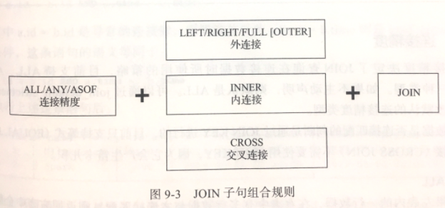

# ClickHouse应用与实践

CK的一个设计思路：Everything is table。<br>

## 外部存储类型引擎
- 这些表引擎只负责 **元数据管理和数据查询**，通常并不负责数据的写入，数据文件直接由外部系统提供。

### HDFS
- 有两种使用形式：
	1. 既读又写
		- 创建表：
			```sql
			CREATE TABLE hdfs_table1(
				id UInt32,
				code String,
				name String
			)ENGINE = HDFS('hdfs://hdp1.nauu.com:8020/clickhouse/hdfs_table1', 'CSV')
			```
			*//CK支持的文件格式，常见有CSV、TSV和JSON等*<br>
		
		- 插入数据：
			```sql
			INSERT INTO hdfs_table1
			SELECT number, concat('code', toString(number)), concat('n', toString(number))
			FROM numbers(5)
			```
			插入结果为：<br>
      | id   | code  | name |
      | :--- | :---  | :--- |
      | 0    | code0 | n0   |
      | 1    | code1 | n1   |
      | 2    | code2 | n2   |
      | 3    | code3 | n3   |
      | 4    | code4 | n4   |
	
			*//CK创建文件/clickhouse/hdfs_table1，以CSV格式写入数据；*<br>
			*//目前CK没有提供删除HDFS文件的方法，即便将数据表删除，HDFS文件依然存在。*<br>
	
	2. 只读不写
		- 此类hdfs_url支持的常见配置方式如下：
			- 绝对路径：读取指定路径单个文件，如/clickhouse/hdfs_table1；
			- *通配符：星号匹配所有字符，如/clickhouse/hdfs_table/*，会读取/clickhouse/hdfs_table路径下所有文件，每个文件对应一个分区；
			- ？通配符：问号匹配单个字符，如/clickhouse/hdfs_table/part_?.csv，其中？代表任意一个合法字符；
			- {M..N}数字区间：如/clickhouse/hdfs_table/part_{2..5}.csv，读取的是/clickhouse/hdfs_table路径下part_2.csv到part_5.csv。

### MySQL
- 与MySQL中的数据表建立映射，可以远程发起查询：SELECT、INSERT。
	```sql
	CREATE TABLE dolphin_scheduler_table(
		id UInt32,
		name String
	)ENGINE = MySQL('host:port', 'database', 'table', 'user', 'password' [, replace_query, 'on_duplicate_clause'])
	```
	*//选填参数：*<br>
	*//-- replcae_query：默认为0，对应MySQL的REPLACE INTO语法；如果设置为1，则会用REPLACE INTO代替INSERT INTO*<br>
	*//-- on_duplicate_clause：默认为0，对应MySQL的ON DUPLICATE KEY语法，如果需要使用该设置，则必须将replcae_query设置为0*<br>
		
- 在具备INSERT写入能力之后，就可以尝试组合玩法，例如创建一张 **物化视图**：
	```sql
	 CREATE MATERIALIZED VIEW view_mysql1
	 ENGINE = MergeTree()
	 ORDER BY id
	 AS SELECT * FROM dolphin_scheduler_table
	```
	*//当通过MySQL表引擎向远端MySQL数据库写入数据的同时，物化视图也会同步更新数据；*<br>
	*//但是，目前MySQL表引擎不支持任何UPDATE和DELETE操作；如果有数据更新方面的诉求，可以考虑使用CollapsingMergeTree作为视图的表引擎。*<br>
	
	
### Kafka
- Kafka表引擎的正确使用方式：

	 

- 首先创建Kafka数据表A，它充当数据管道的角色，负责拉取Kafka中数据：
	```sql
	CREATE TABLE kafka_queue(
		id UInt32,
		code String,
		name String
	)ENGINE = Kafka()
	SETTINGS
		kafka_broker_list = 'hdp1.nauu.com:6667',
		kafka_topic_list = 'salse-queue',
		kafka_group_name = 'chgroup',
		kafka_format = 'JSONEachRow',
		kafka_skip_broken_messages = 100
	```
	*//topic、broker list用逗号分隔*<br>
	
- 创建一张任意引擎的数据表B，充当面向终端用户查询表的角色，在生产环境中通常使用MergeTree系列：
	```sql
	CREATE TABLE kafka_table(
		id UInt32,
		code String,
		name String
	)ENGINE = MergeTree()
	ORDER BY id
	```
- 最后，创建一张物化视图C，负责将A的数据实时同步到B：
	```sql
	CREATE MATERIALIZED VIEW consumer TO kafka_table
	AS SELECT id, code, name FROM kafka_queue
	```
- 如果要停止同步数据，则可以删除视图，或者将其卸载：
	```sql
	DROP TABLE comnsumer
	```
	或者<br>
	```sql
	DETACH TABLE consumer
	```
- 卸载视图之后，再次恢复，则可以使用装载命令：
	```sql
	ATTACH MATERIALIZED VIEW consumer TO kafka_table(
		id UInt32,
		code String,
		name String
	)
	AS SELECT id, code, name FROM kafka_queue
	```
### 其他
- JDBC：需要依赖查询代理服务：clickhouse-jdbc-bridge；
- File：作为一种扩充手段使用。

## 内存类型
- 内存类型表引擎并不意味着它们不支持物理存储；
- 除了Memory表引擎之外，其他几种表引擎都会将数据写入磁盘，为了防止数据丢失，是一种数据恢复的手段；
- 在数据加载时，他们会将数据 **全部**加载到内存，供查询使用；
- 全部加载到内存：一方面拥有较好的查询性能；另一方面如果数据量过大，会带来极大内存消耗；

### Memory
- 直接将数据保存在内存，数据不会被压缩、不会被格式准换，保存形态与查询时看到的一样；
- CK重启，数据全部丢失；
- 数据表被创建时，磁盘上不会创建任何数据文件；
- 广泛应用在CK内部作为集群间分发数据的存储载体来使用；
	- 例如：在分布式IN查询中，会利用Memory临时表保存IN子句的查询结果；
```sql
CREATE TABLE memory_1(
	id UInt32
)ENGINE = MEmory()
```

### Set
- Set表引擎有物理存储，数据线写到内存，然后被同步到磁盘文件, 所以CK重启，数据不会丢失；
- 它具有去重能力，所有元素都是唯一的，数据重复写入会被忽略；
- 支持正常的INSERT写入，但是不支持直接SELECT查询； **只能间接作为IN查询的右侧条件被查询使用**；
 **创建表**<br>
```sql
CREATE TABLE set_1(
	id UInt8
)ENGINE = Set()
```
 **插入数据**<br>
```sql
INSERT INTO TABLE set_1 SELECT number FROM number(10)
```
 **查询数据**<br>
```sql
SLECT arrayJoin([1, 2, 3]) AS a WHERE a IN set_1
```
### Join
- 数据也是先存储到内存，然后再同步到磁盘文件； 
- 等同于将JOIN查询简单封装；
- 既能作为JOIN查询的连接表，又能直接查询使用；
- 声明方式： ENGINE = Join(join_strictness, join_type, key1[, key2, ...])
	- join_strictness：连接数据的策略，目前支持ALL、ANY、ASOF三种类型；
	- join_type：连接类型，支持交集、并集、笛卡尔积或其他形式(INNER、OUTER、CROSS)； *（//当join_strictness为ANY时，join_key重复的数据会被忽略）*
	- join_key：连接键；
- 创建主表并写入数据：
	```sql
	CREATE TABLE main_tb1(
		id UInt8,
		name String,
		time DateTime
	)ENGINE = Log
	```
	```sql
	INSERT INTO TABLE main_tb1
	VALUES(1, 'Clickhouse', '`2020-01-01 00:00:00`'),
	(2, 'Spark', '`2020-01-02 00:00:00`'),
	(3, 'ElasticSearch', '`2020-01-03 00:00:00`')
	```
- 创建Join表并写入数据：
	```sql
	CREATE TABLE id_join_tb1(
		id UInt8,
		price UInt32,
		time DateTime
	)ENGINE = Join(ANY, LEFT, id) 
	```
	```sql
	INSERT INTO TABLE id_join_tb1 
	VALUES(1, 100, '`2020-01-01 00:00:00`'),
	(2, 150, '`2020-01-02 00:00:00`'),
	(3, 240, '`2020-01-03 00:00:00`'),
	(4, 400, '`2020-01-05 00:00:00`')
	```
- 直接查询Join表: `SELECT * FROM id_join_tb1`
- 主战场：
	```sql
	SELECT id, name, price
	FROM main_tb1
	LEFT JOIN id_join_tb1
	USING(id)
	```
- 使用join函数访问：`SELECT joinGet('id_join_tb1', 'price', toUInt8(1))`

### Buffer
- 不支持文件的持久化存储，服务重启，表内数据会被清空；
- 高并发写入场景，导致目标表合并速度慢于写入速度(每一次INSERT都会生成一个新分区目录)；
- 引入Buffer表作为数据写入的缓冲区；
- 数据先写入Buffer表，当满足预设条件时，Buffer表会自动将数据刷新到目标表;
- 声明：ENGINE = Buffer(database, table, num_layers, min_time, max_time, min_rows, max_rows, min_bytes, max_bytes)
	- database、table：目标表库表名；
	- num_layers：线程数，官方建议16；
	- min_time, max_time：时间条件, 单位秒；
	- min_rows, max_rows：数据行条件；
	- min_bytes, max_bytes：数据体量条件；
- 如果三组条件中所有最小阈值都满足，则触发刷新；
- 如果三组条件中至少有一组最大阈值满足，则触发刷新；

 
 
- 实例：
	```sql
	CREATE TABLE buffer_to_memory_tb1 AS memory_tb1
	ENGINE = Buffer(default, memory_tb1, 16, 10, 100, 10000, 1000000, 10000000, 100000000)
	```
	```sql
	INSERT INTO TABLE buffer_to_memory_tb1
	SELECT number FROM numbers(1000001)
	```
	*一次写入1000001行数据，超出数据行最大阈值，立即被写入目标表*<br>
	
## 日志类型
- 如果数据量小(100万以下)，并且一次写入多次查询，日志类型表引擎是一种不错选择；
- 与合并数家族表引擎类似：不支持索引、分区等高级特性；
- 不支持并发写；当有数据写入时，查询会被阻塞，直至写入动作结束；
- 但是它拥有物理存储，数据会被保存至本地文件中；

### TinyLog
- 存储结构由数据文件和元数据文件组成；
- 性能最低，不支持分区，没有标记文件.mrk，无法支持.bin文件的并行读取；

### StripeLog
- 由数据文件、元数据文件、标记文件组成；
- 拥有标记文件.mrk，所以支持并行查询；
- 使用了更少的文件描述符(所有数据使用同一文件保存)；

### Log
- 性能最高，数据文件、元数据文件、标记文件都有；
- 支持并行查询；
- 各列数据独立存储，查询数据时可以按需读取；

## 接口类型
- 自身不存储任何数据，而是像粘合剂一样可以整合其他数据表；
- 不用担心复杂性，就像接口一样，提供统一的访问界面；
### Merge
- 负责合并多个查询的结果集；
- 被代理查询的数据表被要求处于同一个数据库内，且拥有相同的表结构；但是可以使用不同的表引擎以及分区定义；
```sql
CREATE TABLE test_table_all AS test_table_merge
ENGINE = Merge(currentDatabases(), '^test_table_')
```
 *//合并当前库中所有以 test_table_开头的表*<br>
 
## 数据查询
- 不恰当的SQL不仅会带来低性能，还可能导致不可预知的系统错误：
- 例如： 避免使用SELECT *

### WITH
- CK支持CTE(Common Table Expression，公共表表达式)，CTE通过WITH子句表示，目前支持四种用法：
	- 定义变量：`WITH 10 as start SELECT number FROM  system.numbers WHERE number>start`
	- 调用函数：`WITH SUM(data_bytes) as bytes`
	- 定义子查询：`WITH (SELECT ... FROM ...) AS res`
	- 在子查询中重复使用WITH
		```sql
		SELECT id
		FROM(
			WITH (
				SELECT SUM(disk_bytes) FROM table_1
			) AS total_bytes
			SELECT database, SUM(disk_bytes)/total_bytes FROM table_1
		)
		```
### SAMPLE 
- 实现数据采样的功能，是查询仅仅返回采样数据而不是全部数据；
- SAMPLE子句的采样机制是一种幂等设计，即数据不发生变化情况下，总是能够返回相同数据；
	```sql
	CREATE TABLE hits_v1(
		counterId UInt64,
		eventDate DATE,
		userId UInt64
	)ENGINE = MergeTree()
	PARTITION BY toYYYYMM(eventDate)
	ORDER BY (counterId, intHash32(userId))
	SAMPLE BY intHash32(userId)
	```
- Sample Key有两点需要注意：
	1. SAMPLE BY所声明的表达式必须同时包含在主键的声明内；
	2. Sample Key必须是Int类型，如若不是则会报错。
- SAMPLE子句支持3种用法：
	1. SAMPLE factor
		- factor表示采样因子，取值0～1。
		- 统计查询时，为了得到最终的近似结果，就需要将得到的结果乘以采样系数：
			*//可以借助 虚拟字段 _simple_factor来获取采样系数。*<br>
			```sql
			SELECT count() * any(_sample_factor) FROM hits_v1 SAMPLE 0.1
			```
	2. SAMPLE rows
		- 表示按样本数量采样，rows表示至少采样多少行数据， 但是必须是大于1的整数；
			`SELECT count() FROM hits_v1 SAMPLE 1000`<br> 
			*//数据采样的范围是一个近似范围，由于采样数据的最小粒度是由index_granularity索引粒度决定的；*<br>
			*//由此可知，设置一个小于 索引粒度 或者 较小的rows值没有什么意义，应该设置一个较大值。*<br>
	3. SAMPLE factor OFFSET n
		- 表示按照 因子系数factor 和 偏移量n 采样；
		- n表示偏移多少数据才开始采样，它们都是0～1之间的小数；
			```sql
			SELECT counterId FROM hits_v1 SAMPLE 0.4 OFFSET 0.5
			```
### ARRAY JOIN
- ARRAY JOIN 子句允许在数据表的内部与数组或嵌套类型字段进行JOIN操作，从而将一行数组展开为多行；
- 先新建一个包含Array字段的测试表并插入数据：
	```sql
	CREATE TABLE query_v1(
		title String,
		value Array(UInt8)
	)ENGINE = Log
	```
	```sql
	INSERT INTO query_v1
	VALUES ('food', [1, 2, 3]),
	('fruit', [3, 4]),
	('meat', [])
	```
	
- 在一条SELECT语句中只能存在一个ARRAY JOIN (使用子查询除外)；目前支持INNER和LEFT两种JOIN策略：
	1. INNER ARRAY JOIN
		- ARRAY JOIN默认使用INNER JOIN策略：
			`SELECT title, value FROM query_v1 ARRAY JOIN value`
		- 查询结果基于value数组被展开成多行，并且排除掉了空数组;
| title | value |
| :---  | :---  |
| food  | 1     |
| food  | 2     |
| food  | 3     |
| fruit | 3     |
| fruit | 4     |
			
	2. LEFT ARRAY JOIN
		- 在INNER JOIN中被排除的空数组出现在结果集中。
			`SELECT title, value, v FROM query_v1 LEFT ARRAY JOIN value AS v`
| title | value     | v    |
| :---  | :---      | :--- |
| food  | [1, 2, 3] | 1    |
| food  | [1, 2, 3] | 2    |
| food  | [1, 2, 3] | 3    |
| fruit  | [3, 4] | 3    |
| fruit  | [3, 4] | 4    |
| meat   | []     | 0    |
		
- 当同时对多个数组字段进行ARRAY JOIN操作时，查询的计算逻辑是按行合并而不是产生笛卡尔积：
	```sql
	SELECT title, value, v, arrayMap(x->x*2, value) as mapv, v_1
	FROM query_v1 
	LEFT ARRAY JOIN value AS v, mapv AS v_1
	```
| title | value     | v    | mapv      | v_1  |
| :---  | :---      | :--- | :---      | :--- |
| food  | [1, 2, 3] | 1    | [2, 4, 6] | 2    |
| food  | [1, 2, 3] | 2    | [2, 4, 6] | 4    |
| food  | [1, 2, 3] | 3    | [2, 4, 6] | 6    |
| fruit  | [3, 4] | 3    | [6, 8] | 6    |
| fruit  | [3, 4] | 4    | [6, 8] | 8    |
| meat   | []     | 0    | []     | 0    |

- 包含嵌套类型的测试表：
	```sql
	CREATE TABLE query_v2(
		title String,
		nest Nested(
			v1 UInt32,
			v2 UInt64
		)
	)ENGINE = Log
	```
	*//在写入嵌套数据类型时，同一行数据中各个数组的长度需要对齐，而对多行数据之间的数组长度没有限制*<br>
	
	```sql
	INSERT INTO query_v2 
	VALUES('food', [1, 2, 3], [10, 20, 30]),
	('fruit', [3, 4], [30, 40]),
	('meat', [], [])
	```

### JOIN
- 它的语法包含连接精度和连接类型来两部分，目前CK支持的JOIN子句形式如图：
 

#### 连接精度
- 默认为ALL，可以通过join_default_strictness配置参数修改默认的连接精度类型；
- 连接匹配的判断是通过JOIN KEY，目前只支持等式(EQUAL JOIN);
- 交叉连接(CROSS JOIN)不需要使用JOIN KEY，因为它会产生笛卡尔积。

##### ALL
- 如果左表内的一行数据，在右表中有多行数据与之连接匹配，则返回右表中全部连接的数据。

##### ANY
- 如果左表内的一行数据，在右表中有多行数据与之连接匹配，则仅仅返回右表中第一行连接的数据。

##### ASOF
- 是一种模糊连接，它允许在连接键之后追加定义一个模糊连接的匹配条件asof_column:
	```sql
	SELECT a.id, a.name, b.tate, a.time, b.time
	FROM join_tb1 AS a 
	ASOF INNER JOIN join_tb2 AS b
	ON a.id=b.id 
	AND a.time=b.time
	```
	*//其中a.id=b.id是寻常的连接键，而紧跟其后的a.time=b.time 则是asof_column模糊连接条件；*<br>
	*//这条语句的语义等同于：`a.id=b.id AND a.time>=b.time`，且仅返回了右表中第一行连接匹配的数据。*<br>
	
- ASOF支持使用USING的间写形式，USING后声明的最后一个字段会被自动转换为asof_column模糊连接条件：
	```sql
	SELECT a.id, a.name, b.tate, a.time, b.time
	FROM join_tb1 AS a 
	ASOF INNER JOIN join_tb2 AS b
	USING(id, time)
	```
- asof_column字段的使用有两点注意：
	1. asof_column必须是整型、浮点型和日期型这类有序序列的数据类型；
	2. asof_column不能是数据表内的唯一字段，换言之，连接键(JOIN KEY)和asof_column不能是同一个字段。

#### 连接类型
- 连接类型所形成结果是交集、并集、笛卡尔积或是其他形式；

##### INNER
- INNER JOIN表示内连接，以左表为基础，从右表找出与左表连接的行；
- 只会返回左表和右表中交集的部分。

##### OUTER
- OUTER JOIN表示外连接，可以进一步细分为左外连接(LEFT)、右外连接(RIGHT)和全外连接(FULL);
- LEFT OUTER JOIN：
	- 以左表为基础，从右表中找出与左表连接的行以补充属性；
	- 如果在右表中没有找到连接的行，则采用响应字段数据类型的默认值；
	- 换言之，对于左连接查询，左表的数据总是能够全部返回。
- RIGHT OUTER JOIN：
	- 右表的数据总是能够全部返回，而左表不能连接的数据则使用默认值补全；
- FULL JOIN：
	- 全外连接查询会返回左表和右表的并集；

##### CROSS
- CROSS JOIN 表示交叉连接，会返回左表与右表的笛卡尔积；
- CROSS JOIN不需要声明JOIN KEY，因为结果会包含他们的所有组合；
- 交叉连接查询时，会以左表为基础，逐行与右表全集相乘。

#### 多表连接
- 多表连接查询时，CK会将它们转为两两连接的形式；

#### 注意事项
- 为了能优化JOIN查询性能，首先应该遵循左大右下的原则；
- 无论使用哪种连接方式，右表都会被全部加载到内存中与左表进行比较；
- 其次，JOIN查询目前没有缓存的支持，即使连续执行相同SQL，也都会执行一次全新计划；
- 最后，如果是在大量维度属性补全的查询场景中，则建议使用字典代替JOIN查询。
- 空值策略：通过参数join_use_nulls参数指定，默认为0，使用数据类型的默认值填充；当参数为1时，空值由NULL填充。

### GROUP BY
- 除了普通GROUP BY聚合查询，目前还能配合WITH ROLLUP、WITH CUBE 和 WITH TOTAL三种修饰符获取额外汇总信息。
- WITH ROLLUP
	- 它能够按照聚合键从右向左上卷数据，生成分组小计和总计。
		```sql
		SELECT table, name SUM(byte_on_disk) FROM system.parts
		GROUP BY table, name
		WITH ROLLUP
		ORDER BY table
		```
		*//返回结果中附加返回了小计汇总行，包括所有表分区磁盘大小的汇总合计以及每张table内所有分区大小的合计信息。*<br>
- WITH CUBE
	- CUBE像立方体模型一样，基于聚合键之间所有的组合生成小计信息；
	- 如果聚合键有n个，则最终小计组合的个数为2的n次方；
- WITH TOTAL
	- 会基于聚合函数对所有数据进行统计，结果附加了一行total汇总合计。

### LIMIT 
- LIMIT n
- LIMIT n BY express
- LIMIT n OFFSET y BY express
