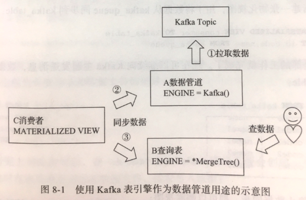
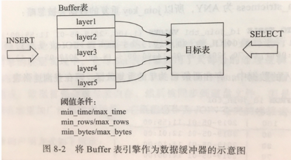

# ClickHouse应用与实践

CK的一个设计思路：Everything is table。<br>

## 外部存储类型引擎
- 这些表引擎只负责 **元数据管理和数据查询**，通常并不负责数据的写入，数据文件直接由外部系统提供。

### HDFS
- 有两种使用形式：
	1. 既读又写
		- 创建表：
			```
			CREATE TABLE hdfs_table1(
				id UInt32,
				code String,
				name String
			)ENGINE = HDFS('hdfs://hdp1.nauu.com:8020/clickhouse/hdfs_table1', 'CSV')
			```
			*//CK支持的文件格式，常见有CSV、TSV和JSON等*<br>
		
		- 插入数据：
			```
			INSERT INTO hdfs_table1
			SELECT number, concat('code', toString(number)), concat('n', toString(number))
			FROM numbers(5)
			```
			插入结果为：<br>
      | id   | code  | name |
      | :--- | :---  | :--- |
      | 0    | code0 | n0   |
      | 1    | code1 | n1   |
      | 2    | code2 | n2   |
      | 3    | code3 | n3   |
      | 4    | code4 | n4   |
	
			*//CK创建文件/clickhouse/hdfs_table1，以CSV格式写入数据；*<br>
			*//目前CK没有提供删除HDFS文件的方法，即便将数据表删除，HDFS文件依然存在。*<br>
	
	2. 只读不写
		- 此类hdfs_url支持的常见配置方式如下：
			- 绝对路径：读取指定路径单个文件，如/clickhouse/hdfs_table1；
			- *通配符：星号匹配所有字符，如/clickhouse/hdfs_table/*，会读取/clickhouse/hdfs_table路径下所有文件，每个文件对应一个分区；
			- ？通配符：问号匹配单个字符，如/clickhouse/hdfs_table/part_?.csv，其中？代表任意一个合法字符；
			- {M..N}数字区间：如/clickhouse/hdfs_table/part_{2..5}.csv，读取的是/clickhouse/hdfs_table路径下part_2.csv到part_5.csv。

### MySQL
- 与MySQL中的数据表建立映射，可以远程发起查询：SELECT、INSERT。
	```
	CREATE TABLE dolphin_scheduler_table(
		id UInt32,
		name String
	)ENGINE = MySQL('host:port', 'database', 'table', 'user', 'password' [, replace_query, 'on_duplicate_clause'])
	```
	*//选填参数：*<br>
	*//-- replcae_query：默认为0，对应MySQL的REPLACE INTO语法；如果设置为1，则会用REPLACE INTO代替INSERT INTO*<br>
	*//-- on_duplicate_clause：默认为0，对应MySQL的ON DUPLICATE KEY语法，如果需要使用该设置，则必须将replcae_query设置为0*<br>
		
- 在具备INSERT写入能力之后，就可以尝试组合玩法，例如创建一张 **物化视图**：
	```
	 CREATE MATERIALIZED VIEW view_mysql1
	 ENGINE = MergeTree()
	 ORDER BY id
	 AS SELECT * FROM dolphin_scheduler_table
	```
	*//当通过MySQL表引擎向远端MySQL数据库写入数据的同时，物化视图也会同步更新数据；*<br>
	*//但是，目前MySQL表引擎不支持任何UPDATE和DELETE操作；如果有数据更新方面的诉求，可以考虑使用CollapsingMergeTree作为视图的表引擎。*<br>
	
	
### Kafka
- Kafka表引擎的正确使用方式：
	 

- 首先创建Kafka数据表A，它充当数据管道的角色，负责拉取Kafka中数据：
	```
	CREATE TABLE kafka_queue(
		id UInt32,
		code String,
		name String
	)ENGINE = Kafka()
	SETTINGS
		kafka_broker_list = 'hdp1.nauu.com:6667',
		kafka_topic_list = 'salse-queue',
		kafka_group_name = 'chgroup',
		kafka_format = 'JSONEachRow',
		kafka_skip_broken_messages = 100
	```
	*//topic、broker list用逗号分隔*<br>
	
- 创建一张任意引擎的数据表B，充当面向终端用户查询表的角色，在生产环境中通常使用MergeTree系列：
	```
	CREATE TABLE kafka_table(
		id UInt32,
		code String,
		name String
	)ENGINE = MergeTree()
	ORDER BY id
	```
- 最后，创建一张物化视图C，负责将A的数据实时同步到B：
	```
	CREATE MATERIALIZED VIEW consumer TO kafka_table
	AS SELECT id, code, name FROM kafka_queue
	```
- 如果要停止同步数据，则可以删除视图，或者将其卸载：
	```
	DROP TABLE comnsumer
	```
	或者<br>
	```
	DETACH TABLE consumer
	```
- 卸载视图之后，再次恢复，则可以使用装载命令：
	```
	ATTACH MATERIALIZED VIEW consumer TO kafka_table(
		id UInt32,
		code String,
		name String
	)
	AS SELECT id, code, name FROM kafka_queue
	```
### 其他
- JDBC：需要依赖查询代理服务：clickhouse-jdbc-bridge；
- File：作为一种扩充手段使用。

## 内存类型
- 内存类型表引擎并不意味着它们不支持物理存储；
- 除了Memory表引擎之外，其他几种表引擎都会将数据写入磁盘，为了防止数据丢失，是一种数据恢复的手段；
- 在数据加载时，他们会将数据 **全部**加载到内存，供查询使用；
- 全部加载到内存：一方面拥有较好的查询性能；另一方面如果数据量过大，会带来极大内存消耗；

### Memory
- 直接将数据保存在内存，数据不会被压缩、不会被格式准换，保存形态与查询时看到的一样；
- CK重启，数据全部丢失；
- 数据表被创建时，磁盘上不会创建任何数据文件；
- 广泛应用在CK内部作为集群间分发数据的存储载体来使用；
	- 例如：在分布式IN查询中，会利用Memory临时表保存IN子句的查询结果；
```
CREATE TABLE memory_1(
	id UInt32
)ENGINE = MEmory()
```

### Set
- Set表引擎有物理存储，数据线写到内存，然后被同步到磁盘文件, 所以CK重启，数据不会丢失；
- 它具有去重能力，所有元素都是唯一的，数据重复写入会被忽略；
- 支持正常的INSERT写入，但是不支持直接SELECT查询； **只能间接作为IN查询的右侧条件被查询使用**；
 **创建表**<br>
```
CREATE TABLE set_1(
	id UInt8
)ENGINE = Set()
```
 **插入数据**<br>
```
INSERT INTO TABLE set_1 SELECT number FROM number(10)
```
 **查询数据**<br>
```
SLECT arrayJoin([1, 2, 3]) AS a WHERE a IN set_1
```
### Join
- 数据也是先存储到内存，然后再同步到磁盘文件； 
- 等同于将JOIN查询简单封装；
- 既能作为JOIN查询的连接表，又能直接查询使用；
- 声明方式： ENGINE = Join(join_strictness, join_type, key1[, key2, ...])
	- join_strictness：连接数据的策略，目前支持ALL、ANY、ASOF三种类型；
	- join_type：连接类型，支持交集、并集、笛卡尔积或其他形式(INNER、OUTER、CROSS)； *（//当join_strictness为ANY时，join_key重复的数据会被忽略）*
	- join_key：连接键；
- 创建主表并写入数据：
	```
	CREATE TABLE main_tb1(
		id UInt8,
		name String,
		time DateTime
	)ENGINE = Log
	```
	```
	INSERT INTO TABLE main_tb1
	VALUES(1, 'Clickhouse', '`2020-01-01 00:00:00`'),
	(2, 'Spark', '`2020-01-02 00:00:00`'),
	(3, 'ElasticSearch', '`2020-01-03 00:00:00`')
	```
- 创建Join表并写入数据：
	```
	CREATE TABLE id_join_tb1(
		id UInt8,
		price UInt32,
		time DateTime
	)ENGINE = Join(ANY, LEFT, id) 
	```
	```
	INSERT INTO TABLE id_join_tb1 
	VALUES(1, 100, '`2020-01-01 00:00:00`'),
	(2, 150, '`2020-01-02 00:00:00`'),
	(3, 240, '`2020-01-03 00:00:00`'),
	(4, 400, '`2020-01-05 00:00:00`')
	```
- 直接查询Join表: `SELECT * FROM id_join_tb1`
- 主战场：
	```
	SELECT id, name, price
	FROM main_tb1
	LEFT JOIN id_join_tb1
	USING(id)
	```
- 使用join函数访问：`SELECT joinGet('id_join_tb1', 'price', toUInt8(1))`

### Buffer
- 不支持文件的持久化存储，服务重启，表内数据会被清空；
- 高并发写入场景，导致目标表合并速度慢于写入速度(每一次INSERT都会生成一个新分区目录)；
- 引入Buffer表作为数据写入的缓冲区；
- 数据先写入Buffer表，当满足预设条件时，Buffer表会自动将数据刷新到目标表;
- 声明：ENGINE = Buffer(database, table, num_layers, min_time, max_time, min_rows, max_rows, min_bytes, max_bytes)
	- database、table：目标表库表名；
	- num_layers：线程数，官方建议16；
	- min_time, max_time：时间条件, 单位秒；
	- min_rows, max_rows：数据行条件；
	- min_bytes, max_bytes：数据体量条件；
- 如果三组条件中所有最小阈值都满足，则触发刷新；
- 如果三组条件中至少有一组最大阈值满足，则触发刷新；

 
 
- 实例：
	```
	CREATE TABLE buffer_to_memory_tb1 AS memory_tb1
	ENGINE = Buffer(default, memory_tb1, 16, 10, 100, 10000, 1000000, 10000000, 100000000)
	```
	```
	INSERT INTO TABLE buffer_to_memory_tb1
	SELECT number FROM numbers(1000001)
	```
	*一次写入1000001行数据，超出数据行最大阈值，立即被写入目标表*<br>
	
## 日志类型
- 如果数据量小(100万以下)，并且一次写入多次查询，日志类型表引擎是一种不错选择；
- 与合并数家族表引擎类似：不支持索引、分区等高级特性；
- 不支持并发写；当有数据写入时，查询会被阻塞，直至写入动作结束；
- 但是它拥有物理存储，数据会被保存至本地文件中；

### TinyLog
- 存储结构由数据文件和元数据文件组成；
- 性能最低，不支持分区，没有标记文件.mrk，无法支持.bin文件的并行读取；

### StripeLog
- 由数据文件、元数据文件、标记文件组成；
- 拥有标记文件.mrk，所以支持并行查询；
- 使用了更少的文件描述符(所有数据使用同一文件保存)；

### Log
- 性能最高，数据文件、元数据文件、标记文件都有；
- 支持并行查询；
- 各列数据独立存储，查询数据时可以按需读取；

## 接口类型
- 自身不存储任何数据，而是像粘合剂一样可以整合其他数据表；
- 不用担心复杂性，就像接口一样，提供统一的访问界面；
### Merge
- 负责合并多个查询的结果集；
- 被代理查询的数据表被要求处于同一个数据库内，且拥有相同的表结构；但是可以使用不同的表引擎以及分区定义；
```
CREATE TABLE test_table_all AS test_table_merge
ENGINE = Merge(currentDatabases(), '^test_table_')
```
 *//合并当前库中所有以 test_table_开头的表*<br>
