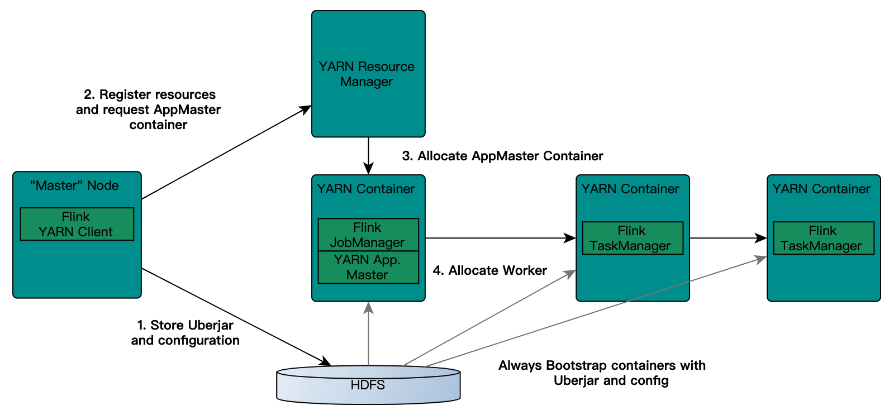
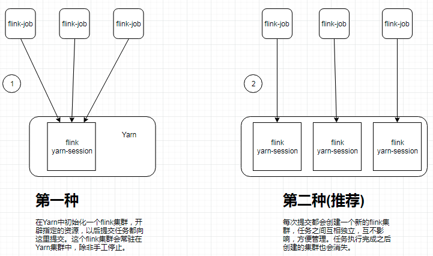
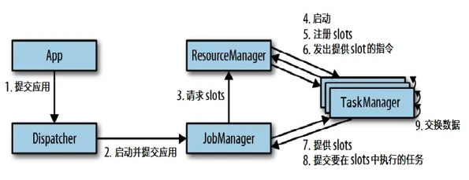
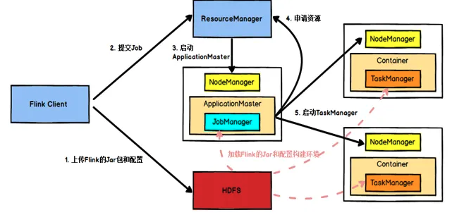
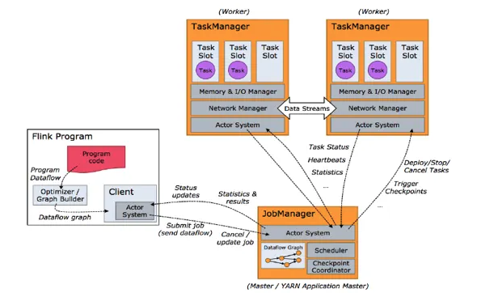

# Flink 任务提交
## Flink on Yarn的整个交互过程图
	
	
	
- 要使得flink运行于yarn上，flink要能找到hadoop配置，因为要连接到yarn的resourcemanager和hdfs。可以使用下面的策略来指定hadoop配置：
	1. 会查看YARN_CONF_DIR，HADOOP_CONF_DIR或者HADOOP_CONF_PATH是否设置，按照顺序检查的。然后，假如配置了就会从该文件夹下读取配置。
	2. 如果上面环境变量都没有配置的话，会使用HADOOP_HOME环境变量。对于hadoop2的话会查找的配置路径是 $HADOOP_HOME/etc/hadoop;对于hadoop1会查找的路径是$HADOOP_HOME/conf.
- 每当创建一个新flink的yarn session的时候，客户端会首先检查要请求的资源(containers和memory)是否可用。然后，将包含flink相关的jar包和配置上传到hdfs。
- 接下来就是客户端会向resourcemanager申请一个yarn container 用以启动ApplicationMaster。由于客户端已经将配置和jar文件注册为了container的资源，所以nodemanager会直接使用这些资源准备好container（例如，下载文件等）。一旦该过程结束，AM就被启动了。
- Jobmanager和AM运行于同一个container。一旦创建成功，AM就知道了Jobmanager的地址。它会生成一个新的flink配置文件，这个配置文件是给将要启动的taskManager用的，该配置文件也会上传到hdfs。另外，AM的container也提供了Flink的web接口。Yarn代码申请的端口都是临时端口，目的是为了让用户并行启动多个Flink YARN Session。
- 最后，AM开始申请启动Flink Taskmanager的containers，这些container会从hdfs上下载jar文件和已修改的配置文件。一旦这些步骤完成，flink就可以接受任务了。
-  * Flink on yarn模式部署时，不需要对Flink做任何修改配置，只需要将其解压传输到各个节点之上。但如果要实现高可用的方案，这个时候就需要到Flink相应的配置修改参数，具体的配置文件是FLINK_HOME/conf/flink-conf.yaml。*

## Flink作业提交
- Flink作业提交有两种模式：
	- Job mode: 
		- Dedicated cluster for a single job;
		- 每次提交Flink任务都会创建一个专用的Flink集群，任务完成后资源释放;
	- Session mode: 
		- Shared cluster for multiple jobs; 
		- Resources can be shared across jobs;
		- 在YARN中提前初始化一个Flink集群，以后所有Flink任务都提交到这个集群.

	

### Session Mode
- 创建Flink集群：`./bin/yarn-session.sh -n 2 -jm 1024 -tm 1024` **//-n参数表示TaskManager的数量，-jm表示JobManager的内存大小，-tm表示每个TaskManager的内存大小**
- 然后提交任务： `bin/flink run ./examples/batch/WordCount.jar -input hdfs:///input/GoneWiththeWind.txt -output hdfs:///wordcount-result.txt`
- yarn seesion(Start a long-running Flink cluster on YARN)这种方式需要先启动集群，然后在提交作业，接着会向yarn申请一块空间后，资源永远保持不变。如果资源满了，下一个作业就无法提交，只能等到yarn中的其中一个作业执行完成后，释放了资源，那下一个作业才会正常提交.
- JobManager的个数只能是一个，同一个Session中可以提交多个Flink作业。如果想要停止Flink Yarn Application，需要通过yarn application -kill命令来停止。通过-d指定分离模式，即客户端在启动Flink Yarn Session后，就不再属于Yarn Cluster的一部分。

	```
	yarn-session的参数介绍
  -n ： 指定TaskManager的数量；
  -d: 以分离模式运行；
  -id：指定yarn的任务ID；
  -j:Flink jar文件的路径;
  -jm：JobManager容器的内存（默认值：MB）;
  -nl：为YARN应用程序指定YARN节点标签;
  -nm:在YARN上为应用程序设置自定义名称;
  -q:显示可用的YARN资源（内存，内核）;
  -qu:指定YARN队列;
  -s:指定TaskManager中slot的数量;
  -st:以流模式启动Flink;
  -tm:每个TaskManager容器的内存（默认值：MB）;
  -z:命名空间，用于为高可用性模式创建Zookeeper子路径;
	```

### Job Mode
- 提交任务：
		```
		bin/flink run -m yarn-cluster \
		-yn 2 \
		-yjm 1024 \
		-ytm 1024 \
		./examples/batch/WordCount.jar \
		-input hdfs://192.168.50.134:8020/input/GoneWiththeWind.txt \
		-output hdfs://192.168.50.134:8020/wordcount-result-1.txt
		```
- 查看参数: `./bin/flink run --help`
- Flink run直接在YARN上提交运行Flink作业(Run a Flink job on YARN)，这种方式的好处是一个任务会对应一个job,即没提交一个作业会根据自身的情况，向yarn申请资源，直到作业执行完成，并不会影响下一个作业的正常运行，除非是yarn上面没有任何资源的情况下。
- 一个yarn session模式对应一个JobManager,并按照需求提交作业，同一个Session中可以提交多个Flink作业。如果想要停止Flink Yarn Application，需要通过yarn application -kill命令来停止.

## Flink组件协作
 	
	

### 任务提交流程（YARN）
	
	

- 在Flink任务提交后：
	1. Client向HDFS上传Flink的Jar包和配置
	2. 向Yarn ResourceManager提交任务
	3. ResourceManager分配Container资源并通知对应的NodeManager启动ApplicationMaster
	4. ApplicationMaster启动后加载Flink的Jar包和配置构建环境
	5. 启动JobManager，之后ApplicationMaster向ResourceManager申请资源启动TaskManager
	6. ResourceManager分配Container资源后，由ApplicationMaster通知资源所在节点的NodeManager启动TaskManager，NodeManager加载Flink的Jar包和配置构建环境并启动TaskManager
	7. TaskManager启动后向JobManager发送心跳包，并等待JobManager向其分配任务。

### 任务调度原理
	
	

- 当Flink集群启动后，首先会启动一个JobManger 和一个或多个的 TaskManager;
- 由 Client 提交任务给 JobManager，JobManager 再调度任务到各个 TaskManager 去执行，然后 TaskManager 将心跳和统计信息汇报给 JobManager;
- TaskManager 之间以流的形式进行数据的传输。上述三者均为独立的 JVM 进程;
- 客户端不是运行时和程序执行的一部分，但它用于准备并发送dataflow(JobGraph)给Master(JobManager)，然后，客户端断开连接或者维持连接以等待接收计算结果。
- Client 为提交 Job 的客户端，可以是运行在任何机器上（与 JobManager 环境连通即可）。提交 Job 后，Client 可以结束进程（Streaming的任务），也可以不结束并等待结果返回;
- JobManager 主要负责调度 Job 并协调 Task 做 checkpoint，职责上很像 Storm 的 Nimbus。从 Client 处接收到 Job 和 JAR 包等资源后，会生成优化后的执行计划，并以 Task 的单元调度到各个 TaskManager 去执行;
- TaskManager 在启动的时候就设置好了槽位数（Slot），每个 slot 能启动一个 Task，Task 为线程。从 JobManager 处接收需要部署的 Task，部署启动后，与自己的上游建立 Netty 连接，接收数据并处理。
